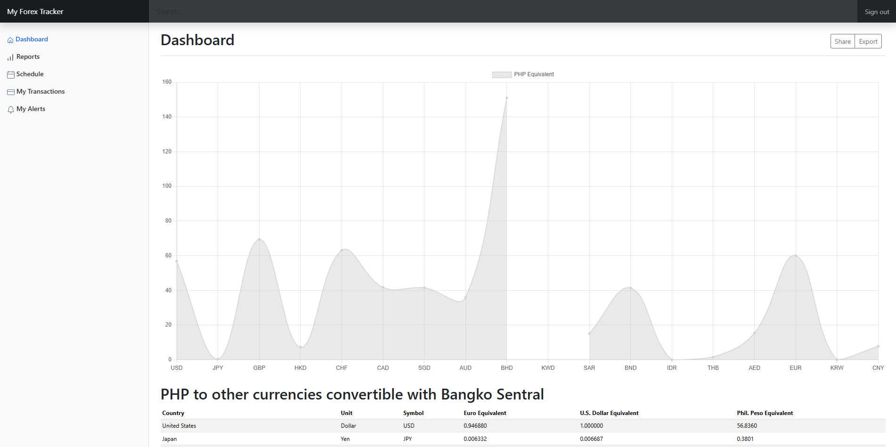

# PHP Equivalent Dashboard

A simple, responsive PHP Equivalent Dashboard that visualizes the exchange rates of foreign currencies to the Philippine Peso (PHP). Built using **HTML**, **JavaScript**, **Bootstrap 5**, and **Chart.js**, this dashboard displays a clean and interactive line chart comparing multiple currencies' PHP equivalents.



## Features

- Line graph visualization using Chart.js
- Exchange rates for 17+ foreign currencies
- Responsive and mobile-friendly UI with Bootstrap 5
- Simple sidebar navigation (Dashboard, Reports, Calendar)
- Clean modular code for easy updates and customization

## Files

| File Name        | Description                                     |
|------------------|-------------------------------------------------|
| `salvador_lr.html` | Main HTML dashboard layout                     |
| `dashboard.js`     | JavaScript logic to plot data using Chart.js   |
| `dashboard-view.png` | Screenshot of the final output               |

## Technologies Used

- HTML5
- CSS3 (via Bootstrap 5)
- JavaScript (ES6)
- [Chart.js](https://www.chartjs.org/)

## Clone the Project

To run the project locally:

1. Clone the repository:
   ```bash
   git clone https://github.com/ludreinsalvador/php-equivalent-dashboard.git
